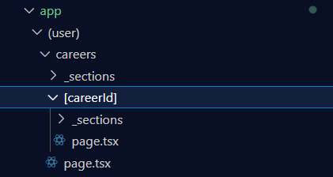
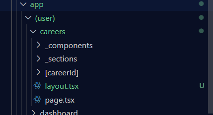
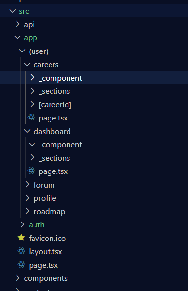

# Cài đặt dự án
- git clone 
- npm install
- npm run dev

# Những điểm chú ý của NextJS 
- Cấu trúc của next

    - Khi tạo file page.tsx trong thư mục con của app sẽ tạo một route cho nó 
        - Ví dụ: page.tsx trong thư mục careers -> tạo route localhost:3000/careers
    - (user): để tạo một nhóm các route cho role user
    - [careerId]: để tạo một route động 
        - Ví dụ: page.tsx trong thưc mục [careerId] -> tạo route localhost:3000/careers/[careerId]
        - vì đây là route động nên có thể thay [careerId] bằng bất cứ kí tự nào, chẳng hạn: /careers/abc, /careers/xyz
    - layout.tsx: Tạo layout chung cho toàn bộ thư mục đó và thư mục con
    
        - File layout.tsx trong thư mục careers sẽ được áp dụng cho toàn bộ trang careers và các trang con 
- Các hook quan trọng của next
    - const router = useRouter() 
        - Cần dùng khi muốn điều hướng trong trang web: router.push("/auth/login"): chuyển hướng qua trang login
    - const pathname = usePathname(), const searchParams = useSearchParams(): search chatgpt 

# Những điểm chú ý của MUI 
- Không set mã màu hex, ví dụ: #000, #ccc (muốn có màu thì nói t thêm)
- Dùng component Stack thay cho Box + display: flex + direction: column
- Dùng component RowStack thay cho Box + display: flex + direction: row

# Cấu trúc dự án hiện tại
- Thư mục api: 
    - Định nghĩa các api để giao tiếp với backend, chia theo từng module riêng biệt
- Thư mục app:
    - File page.tsx -> gọi component được định nghĩa bên trong content.tsx của section
    - File content.tsx -> Định nghĩa UI cho toàn bộ trang web đó, nếu trang đó có nhiều thì có thể tạo các section nhỏ như FilterCareer, ContentCareer,... rồi dùng trong file content.tsx
- Thư mục components: 
    - Định nghĩa các component cho toàn bộ source
- Thư mục context: 
    - Tạo các context để chia sẻ data chung 
- Thư mục types
    - Định nghĩa type, mockdata cho từng module
- Thư mục utils: 
    - Định nghĩa các hàm tiện ích để dùng chung: như formatNumber, formatCurrency,...

# Phân biệt 3 thư mục components trong careers, dashboard và ở ngoài

- Các component định nghĩa trong thư mục careers/_components chỉ được dùng cho trang careers và các trang con của nó (như [careerId])
- Tương tự, các component định nghĩa trong thư mục dashboard/_components chỉ được dùng cho trang dashboard và các trang con của nó 
- Các component định nghĩa bên trong thư mục components sẽ được dùng cho toàn bộ source

# Phân biệt sections và components
- Section: Chỉ dùng một lần duy nhất (có trường hợp ngoại lệ)
- Component: Có thể dùng nhiều lần 

# Quy tắc
- Đặt tên file theo kebab-case: career-detail.tsx
- Đặt tên file rõ nghĩa, thể hiện được nội dung của file 
- Mỗi file không quá 400 dòng
- Dùng useCallback, useMemo để tối ưu 
- Cần sửa bất kì gì chung cho toàn bộ trang web thì nói lại t 